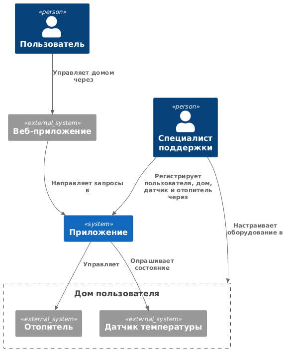
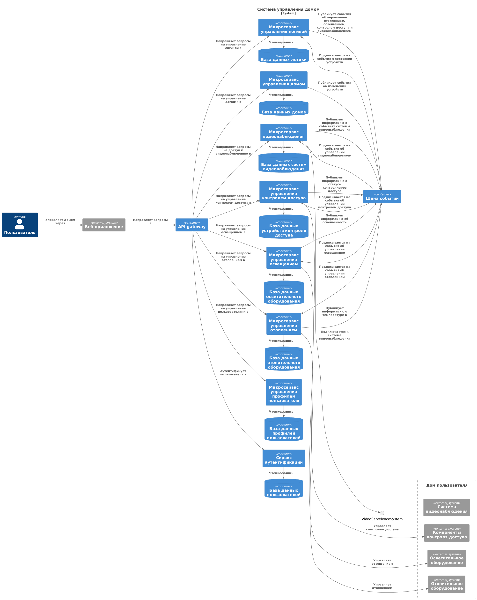
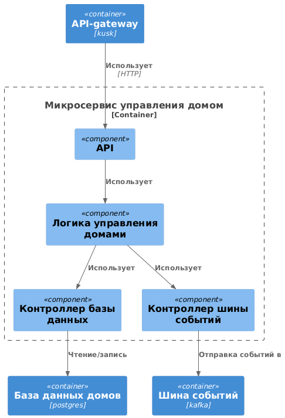
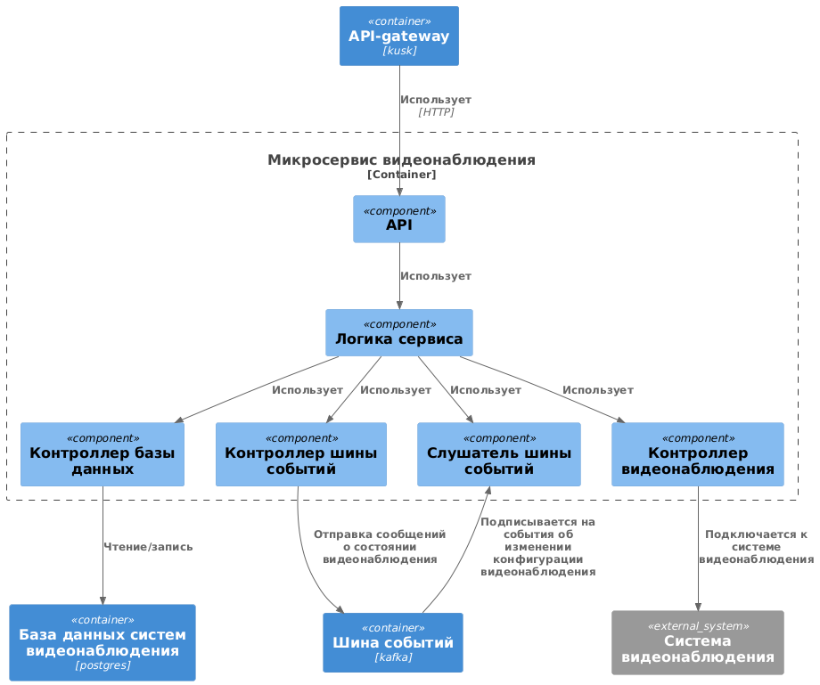
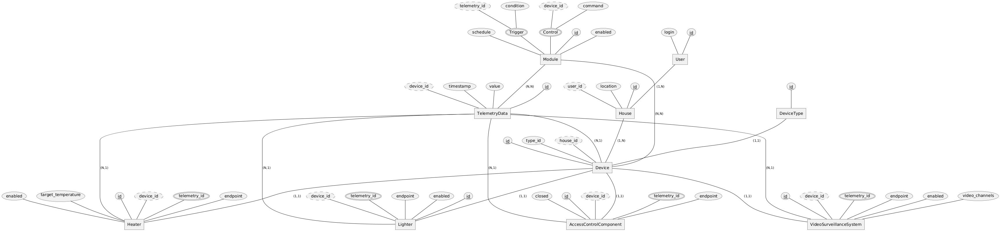

# Проектная работа. Часть 1

## 1. Анализ и планирование

### 1.1. Функциональность монолитной системы

* **Управление отоплением**. Пользователи могут удалённо включать/выключать отопление в своих домах через веб-интерфейс.
* **Мониторинг температуры**. Система получает данные о температуре с датчиков, установленных в домах. Пользователи могут просматривать текущую температуру в своих домах через веб-интерфейс.

### 1.2. Анализ архитектуры монолитной системы

* Язык приложения: Java
* База данных: PostgreSQL
* Архитектура: монолитная
* Взаимодействие: синхронное
* Масштабируемость: горизонтальная масштабируемость системы в текущем исполнении - затруднительна
* Развертывание: требует остановки всей системы

### 1.3. Домены и границы контекстов

* Домен: управление пользователями
  * контекст: регистрация новых пользователей
  * контекст: редактирование прав пользователей до домов
* Домен: управление домами
  * контекст: регистрация новых домов
  * контекст: регистрация устройств и датчиков в доме
* Домен: управление устройствами
  * контекст: управление отоплением
  * контекст: мониторинг температуры

### 1.4. Существующие проблемы

* Синхронные вызовы к датчикам. С ростом числа пользователей системы, количество синхронных запросов до датчиков, которые должна сделать система, будет увеличиваться. Также будет увеличиваться и время отклика до датчиков пользователей в удаленных регионах страны, что будет приводить к замедлению работы приложения.
* Монолитность приложения. Нагрузка на систему в скором времени должна увеличиться в разы, однако, монолитность приложения затрудняет возможности горизонтального масштабирования.
* Сложность конфигурирования. Система сложна настолько, что для выполнения данных работ требуется выезд специалистов компании. С расширением бизнеса, данная проблема потребует открывать офис в каждом регионе присутствия со своей командой по обслуживанию клиентов.

### 1.5. Диаграмма контекста

[Ссылка на диаграмму в PlantUML](./diagrams/C4_Context_As-Is.puml)

## 2. Проектирование микросервисной архитектуры

### 2.1. Декомпозиция приложения на микросервисы

* Домен: управление пользователями
  * микросервис: аутентификация и авторизация пользователей
  * микросервис: управление профилями пользователей
* Домен: управление домами
  * микросервис: управление домами
* Домен: управление устройствами
  * микросервис: управление отоплением
  * микросервис: управление освещением
  * микросервис: управление контролем доступом (ворота, двери и другие запирающие механизмы)
  * микросервис: видеонаблюдение
  * микросервис: управление пользовательской логикой (программирование)

У каждого микросервиса будет своя независимая БД.
Роль микросервиса управления отоплением может выполнять существующее монолитное приложение.

### 2.2. Взаимодействия

* Доступ до микросервисов из веб-приложения будет осуществляться через API-gateway (kusk).
* Общение между микросервисами будет асинхронным, с использованием шины событий (kafka), например:
  * Микросервис управления домами публикует события об изменении системы (появлении нового оборудования: отопительного, осветительного, контроля доступа, видеонаблюдения)
  * Микросервисы управления устройствами реагируют на события, которые имеют отношения к ним, записывают информацию о оборудовании в свои БД
  * Микросервисы управления устройствами публикуют сообщения о состоянии оборудования
  * Микросервис управления логикой может реагировать на сообщения о состоянии и генерирует в свою очередь события об управлении в соответствии с пользовательскими настройками (алгоритмами)
  * Микросервисы управления устройствами реагируют на события от микросервиса логики

### 2.3. Диаграммы

1. Диаграмма контейнеров

[Ссылка на диаграмму контейнера в PlantUML](./diagrams/C4_Container_To-Be.puml)

2. Диаграммы компонентов

Приведены диаграммы компонентов двух микросервисов:

[Ссылка на диаграммы в PlantUML](./diagrams/C4_Component_To-Be.puml)

  - микросервис управления домами

  - микросервис управления видеонаблюдением

## 3. Разработка ER-диаграммы

### 3.1. Идентификация сущностей

* Пользователь - User
* Дом - House
* Устройство - Device
* Тип устройства - DeviceType
* Отопительное устройство - Heater
* Осветительное устройство - Lighter
* Устройство контроля доступа - AccessControlComponent
* Устройство видеонаблюдения - VideoSurveillanceSystem
* Телеметрия - TelemetryData
* Модуль (логики) - Module

### 3.2 ER-диаграмма (отражены основные атрибуты и связи)

[Ссылка на диаграмму в PlantUML](./diagrams/ER_To-Be.puml)

